# tapps-brain — Architecture Diagrams

Code-aligned visual reference. Every diagram below is generated from the current `src/tapps_brain/` tree or hand-authored against current call-site code. Sources of truth:

- [src/tapps_brain/](../../src/tapps_brain/) — the code
- [docs/engineering/system-architecture.md](system-architecture.md) — the narrative
- [docs/engineering/call-flows.md](call-flows.md) — the request flows
- [docs/architecture.html](../architecture.html) — interactive pan/zoom/toggle viewer (open in browser)
- [docs/engineering/architecture-report.html](architecture-report.html) — full per-package report with SVG flows

## Refresh procedure

```bash
# All five regenerate from current code:
docs_generate_interactive_diagrams(
  diagram_types="dependency,module_map,c4_context,c4_container,c4_component,er_diagram",
  output_path="docs/architecture.html", motion="subtle"
)
docs_generate_architecture(output_path="docs/engineering/architecture-report.html", motion="subtle")
docs_generate_diagram(diagram_type="er_diagram", scope="src/tapps_brain/models.py")
docs_generate_diagram(diagram_type="class_hierarchy", scope="src/tapps_brain/errors.py")
docs_generate_diagram(diagram_type="c4_component", scope="src/tapps_brain/mcp_server")
```

When code changes substantially, re-run all five and commit the regenerated `*.html` outputs alongside this `diagrams.md` update.

---

## 1. C4 — System Context

Who talks to tapps-brain and why. The brain is one Docker container fronted by HTTP + MCP; agents never touch Postgres directly.

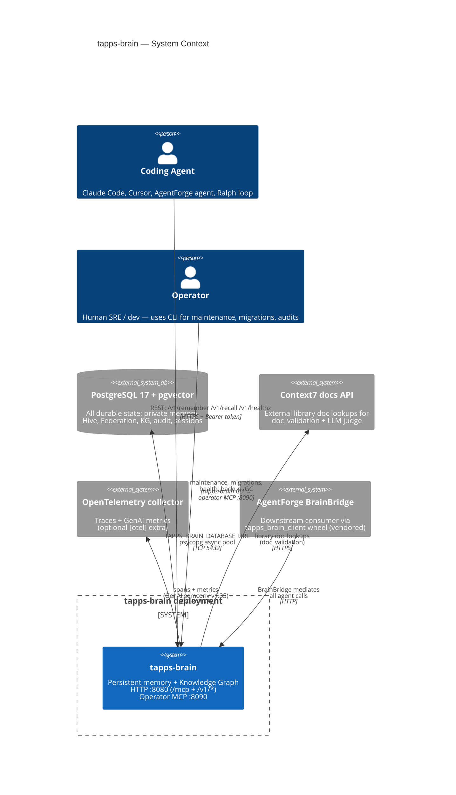

**Read this as:** the dashed lines (external) are out-of-process; the box around `tapps-brain` is one container that mounts both `/mcp` and `/v1/*` on port 8080 plus a separate operator MCP on 8090. All durable state goes to one Postgres unless `TAPPS_BRAIN_HIVE_DSN` / `TAPPS_BRAIN_FEDERATION_DSN` are set to split.

References: [CLAUDE.md — Key environment variables](../../CLAUDE.md), [docs/guides/deployment.md](../guides/deployment.md), [docs/guides/agentforge-integration.md](../guides/agentforge-integration.md).

---

## 2. C4 — Container

How a request lands inside the container and reaches Postgres.

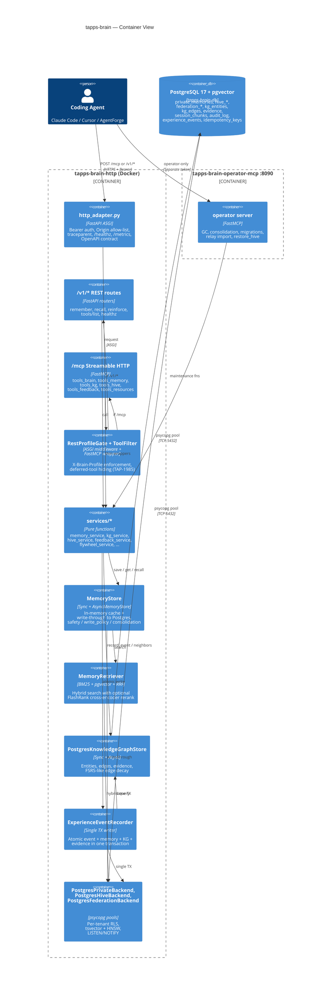

References: [src/tapps_brain/http_adapter.py](../../src/tapps_brain/http_adapter.py), [src/tapps_brain/mcp_server/server.py](../../src/tapps_brain/mcp_server/server.py), [src/tapps_brain/services/](../../src/tapps_brain/services/), [src/tapps_brain/store.py](../../src/tapps_brain/store.py).

---

## 3. C4 — Component (MCP server)

The MCP server is a thin wrapper layer over the service functions; each `tools_*` module registers a family of tools.

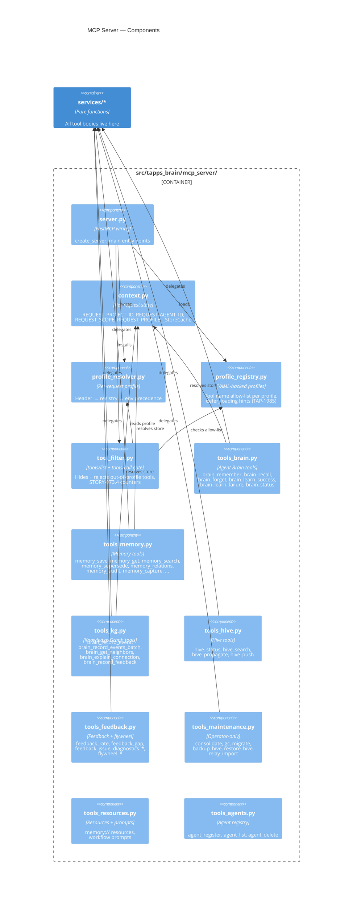

References: [src/tapps_brain/mcp_server/](../../src/tapps_brain/mcp_server/), [docs/planning/epics/EPIC-073.md](../planning/epics/EPIC-073.md).

---

## 4. C4 — Component (Services layer)

Pure service functions — transport-agnostic. Every `@mcp.tool` and REST route ultimately calls one of these.

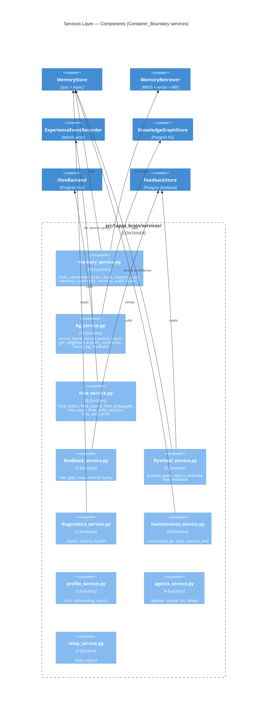

---

## 5. Entity-Relationship — Pydantic / dataclass models

Generated from [src/tapps_brain/models.py](../../src/tapps_brain/models.py). `MemoryEntry` is the spine — every persisted row maps to one.

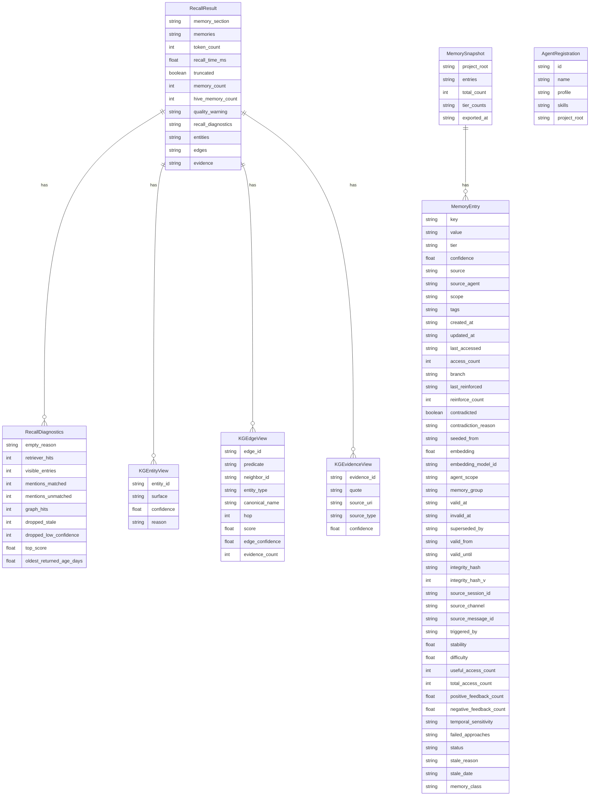

For the wire-shape Postgres schema (DDL, indexes, RLS), see [docs/engineering/data-stores-and-schema.md](data-stores-and-schema.md).

---

## 6. Error taxonomy — class hierarchy

Stable wire taxonomy ([src/tapps_brain/errors.py](../../src/tapps_brain/errors.py)) layered on top of the semantic SDK hierarchy ([src/tapps_brain/exceptions.py](../../src/tapps_brain/exceptions.py)).

```mermaid
classDiagram
    class TaxonomyError {
        +error_code: ErrorCode
        +http_body() dict
        +mcp_data() dict
        +http_status() int
        +jsonrpc_code() int
        +retry() RetryPolicy
    }
    class BrainDegradedError {
        error=brain_degraded, http=503, retry=safe
    }
    class BrainRateLimitedError {
        error=brain_rate_limited, http=429, retry=backoff
    }
    class ProjectNotFoundError {
        error=project_not_registered, http=403, retry=never
    }
    class InvalidRequestError {
        error=invalid_request, http=400, retry=never
    }
    class IdempotencyConflictError {
        error=idempotency_conflict, http=409, retry=never
    }
    class NotFoundError {
        error=not_found, http=404, retry=never
    }
    class InternalError {
        error=internal_error, http=500, retry=safe-once
    }

    TaxonomyError <|-- BrainDegradedError
    TaxonomyError <|-- BrainRateLimitedError
    TaxonomyError <|-- ProjectNotFoundError
    TaxonomyError <|-- InvalidRequestError
    TaxonomyError <|-- IdempotencyConflictError
    TaxonomyError <|-- NotFoundError
    TaxonomyError <|-- InternalError

    class TappsBrainError {
        Root SDK exception
    }
    class TappsBrainTransportError {
        Network / DNS / TLS / timeout
    }
    class TappsBrainAuthError {
        401 / 403 + ProjectNotFound
    }
    class TappsBrainTransientError {
        429 + 5xx, retry-safe
    }
    class TappsBrainNotFoundError {
        404
    }
    class TappsBrainValidationError {
        400 / 409 / 422
    }

    TappsBrainError <|-- TappsBrainTransportError
    TappsBrainError <|-- TappsBrainAuthError
    TappsBrainError <|-- TappsBrainTransientError
    TappsBrainError <|-- TappsBrainNotFoundError
    TappsBrainError <|-- TappsBrainValidationError

    TappsBrainTransientError <|-- BrainDegradedError
    TappsBrainTransientError <|-- BrainRateLimitedError
    TappsBrainAuthError <|-- ProjectNotFoundError
    TappsBrainValidationError <|-- InvalidRequestError
    TappsBrainValidationError <|-- IdempotencyConflictError
    TappsBrainNotFoundError <|-- NotFoundError
    TappsBrainError <|-- InternalError
```

**Catch by intent.** Match on `TappsBrainAuthError` (fix token, stop), `TappsBrainTransientError` (the SDK retried already — escalate), `TappsBrainTransportError` (degrade gracefully). The wire `ErrorCode` enum and `RetryPolicy` are documented in full in [docs/guides/errors.md](../guides/errors.md).

---

## 7. Sequence — `brain_recall` end-to-end

How an agent question turns into ranked memories. Hand-authored against [services/memory_service.py::brain_recall](../../src/tapps_brain/services/memory_service.py), [recall.py::RecallOrchestrator](../../src/tapps_brain/recall.py), [retrieval.py::MemoryRetriever](../../src/tapps_brain/retrieval.py), and [fusion.py](../../src/tapps_brain/fusion.py).

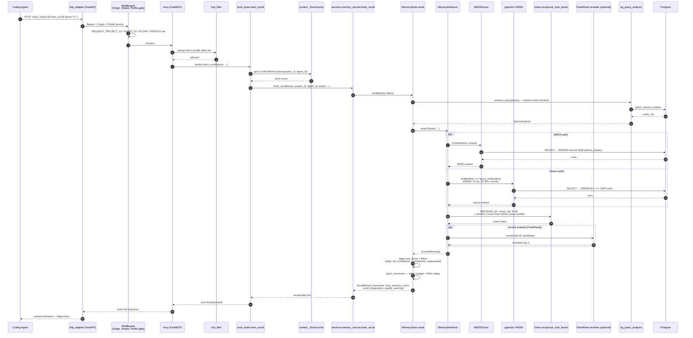

References: [docs/guides/auto-recall.md](../guides/auto-recall.md), [docs/guides/decay.md](../guides/decay.md), [docs/guides/knowledge-graph.md](../guides/knowledge-graph.md).

---

## 8. Sequence — `brain_remember` write path

The save pipeline: safety → write policy → conflict resolution → persistence → propagation → consolidation. From [services/memory_service.py::brain_remember](../../src/tapps_brain/services/memory_service.py), [store.py::MemoryStore.save](../../src/tapps_brain/store.py), and [_save_pipeline.py](../../src/tapps_brain/_save_pipeline.py).

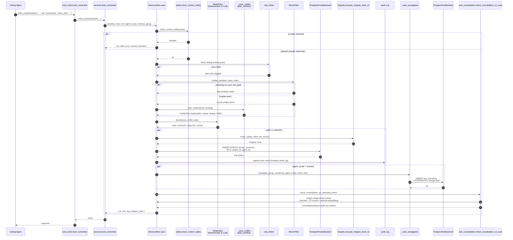

References: [docs/engineering/call-flows.md](call-flows.md), [docs/guides/save-conflict-nli-offline.md](../guides/save-conflict-nli-offline.md), [docs/guides/write-path-tradeoff.md](../guides/write-path-tradeoff.md), [src/tapps_brain/integrity.py](../../src/tapps_brain/integrity.py).

---

## 9. Sequence — `brain_record_event` (atomic KG write)

The single-transaction path: one event + memory + entities + edges + evidence committed atomically. From [experience.py::ExperienceEventRecorder.record](../../src/tapps_brain/experience.py).

```mermaid
sequenceDiagram
    autonumber
    participant Agent
    participant Tool as tools_kg.brain_record_event
    participant Svc as services.kg_service.record_event
    participant Rec as ExperienceEventRecorder
    participant CM as PostgresConnectionManager
    participant Conn as psycopg Connection (TX)
    participant Memo as private_memories table
    participant Ent as kg_entities table
    participant Edge as kg_edges table
    participant Ev as evidence table
    participant Evt as experience_events table

    Agent->>Tool: brain_record_event(event_type, payload, memory, entities, edges)
    Tool->>Svc: record_event(cm, project_id, brain_id, ExperienceEvent)
    Svc->>Rec: record(event)
    Rec->>CM: project_context(project_id)
    CM->>Conn: BEGIN transaction (RLS scope set)
    Note over Conn: All writes below share<br/>one psycopg transaction
    Rec->>Evt: INSERT experience_events
    opt memory provided
        Rec->>Memo: INSERT private_memories
    end
    opt entities provided
        Rec->>Ent: UPSERT kg_entities (canonical_name UPSERT)
        Ent-->>Rec: entity_ids
    end
    opt edges provided
        Rec->>Edge: UPSERT kg_edges (predicate, src, dst, confidence)
        Note over Edge: evidence_required=True by default;<br/>edges without evidence cap confidence at 0.4
    end
    opt evidence provided
        Rec->>Ev: INSERT evidence rows<br/>(quote, source_uri, source_type)
    end
    alt all succeeded
        Conn->>Conn: COMMIT
        Rec-->>Svc: ExperienceResult(event_id, entity_ids, edge_ids)
    else any error
        Conn->>Conn: ROLLBACK
        Note over Conn: Including the event row —<br/>no partial writes possible
        Rec-->>Svc: raise IntegrityError
    end
    Svc-->>Tool: result
    Tool-->>Agent: ok
```

References: [docs/engineering/experience-events.md](experience-events.md), [docs/planning/adr/ADR-012-evidence-required-edges.md](../planning/adr/ADR-012-evidence-required-edges.md), [docs/planning/adr/ADR-011-kg-schema-postgres.md](../planning/adr/ADR-011-kg-schema-postgres.md).

---

## 10. Sequence — Hive propagation

How a `share_with="domain"` write fans out to other agents. From [_save_propagation.py](../../src/tapps_brain/_save_propagation.py) and [postgres_hive.py](../../src/tapps_brain/postgres_hive.py).

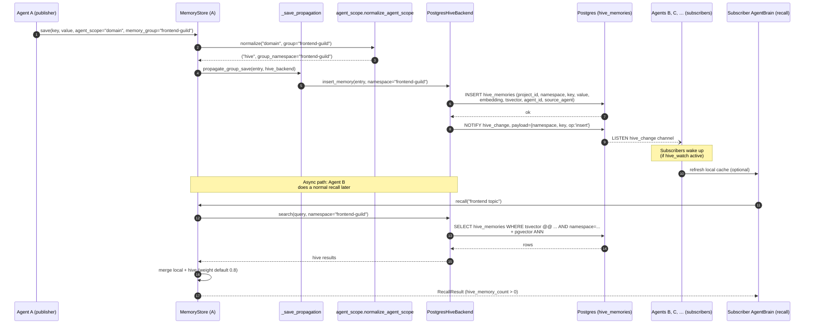

References: [docs/guides/hive.md](../guides/hive.md), [docs/guides/hive-deployment.md](../guides/hive-deployment.md), [docs/guides/hive-vs-federation.md](../guides/hive-vs-federation.md), [docs/planning/epics/EPIC-056.md](../planning/epics/EPIC-056.md).

---

## 11. Dependency overview

Auto-generated import graph (truncated to 50 of 138 modules; see [docs/architecture.html](../architecture.html) for the full interactive viewer).

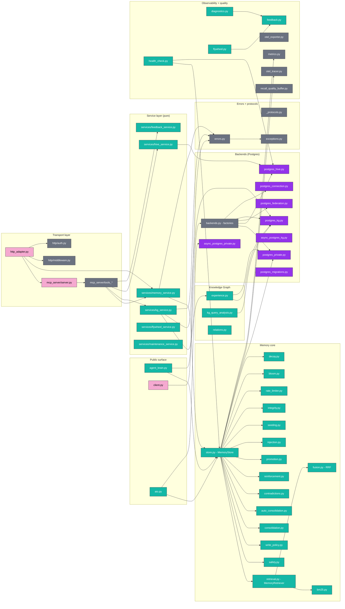

---

## 12. Hexagonal / Ports-and-Adapters layering

```mermaid
flowchart TB
    subgraph adapters_in["Inbound adapters"]
      A1[HTTP /v1/* REST]:::presentation
      A2[MCP /mcp tools]:::presentation
      A3[Operator MCP :8090]:::presentation
      A4[CLI - tapps-brain]:::presentation
      A5[AgentBrain Python facade]:::presentation
      A6[TappsBrainClient SDK]:::presentation
    end

    subgraph core_h["Core domain - pure"]
      D1[services.* - business operations]:::business
      D2[MemoryStore - state + invariants]:::business
      D3[Retrieval pipeline - BM25 + vec + RRF]:::business
      D4[ExperienceEventRecorder - atomic KG]:::business
      D5[Consolidation + Decay + Promotion]:::business
      D6[Safety + WritePolicy]:::business
    end

    subgraph ports["Ports - _protocols.py"]
      P1[PrivateBackend]:::infra
      P2[HiveBackend]:::infra
      P3[FederationBackend]:::infra
      P4[KnowledgeGraphBackend]:::infra
      P5[AgentRegistryBackend]:::infra
      P6[WritePolicy]:::infra
      P7[Reranker]:::infra
      P8[EmbeddingProvider]:::infra
      P9[LookupEngine]:::infra
      P10[LLMJudge]:::infra
    end

    subgraph adapters_out["Outbound adapters"]
      O1[PostgresPrivateBackend]:::data
      O2[AsyncPostgresPrivateBackend]:::data
      O3[PostgresHiveBackend]:::data
      O4[PostgresFederationBackend]:::data
      O5[PostgresKnowledgeGraphStore]:::data
      O6[AsyncPostgresKnowledgeGraphStore]:::data
      O7[FileAgentRegistryBackend]:::data
      O8[PostgresAgentRegistry]:::data
      O9[FlashRankReranker - optional]:::infra
      O10[SentenceTransformerProvider - optional]:::infra
      O11[Context7 docs lookup - optional]:::infra
      O12[AnthropicJudge / OpenAIJudge - optional]:::infra
    end

    A1 --> D1
    A2 --> D1
    A3 --> D1
    A4 --> D1
    A5 --> D1
    A6 --> D1

    D1 --> D2
    D2 --> D3
    D2 --> D5
    D2 --> D6
    D1 --> D4

    D2 --> P1
    D2 --> P2
    D2 --> P3
    D4 --> P4
    D1 --> P5
    D2 --> P6
    D3 --> P7
    D3 --> P8
    D6 --> P9
    D5 --> P10

    P1 --> O1
    P1 --> O2
    P2 --> O3
    P3 --> O4
    P4 --> O5
    P4 --> O6
    P5 --> O7
    P5 --> O8
    P7 --> O9
    P8 --> O10
    P9 --> O11
    P10 --> O12

    classDef presentation fill:#F5A9D0,stroke:#333,color:#000
    classDef business fill:#14B8A6,stroke:#333,color:#fff
    classDef data fill:#9333EA,stroke:#333,color:#fff
    classDef infra fill:#6B7280,stroke:#333,color:#fff
```

This is the architectural invariant tapps-brain enforces. Core never imports from `tapps_brain.http.*` or `tapps_brain.postgres_*` directly — it depends only on the protocols in [`_protocols.py`](../../src/tapps_brain/_protocols.py). Backends are wired by the factories in [`backends.py`](../../src/tapps_brain/backends.py) based on DSN inspection.

---

## See also

- [docs/architecture.html](../architecture.html) — interactive viewer (Mermaid + pan/zoom + ToC)
- [docs/engineering/architecture-report.html](architecture-report.html) — printable HTML report with SVG flows
- [docs/engineering/system-architecture.md](system-architecture.md) — narrative architecture doc
- [docs/engineering/call-flows.md](call-flows.md) — text walkthrough of remember/recall/hive flows
- [docs/engineering/data-stores-and-schema.md](data-stores-and-schema.md) — Postgres DDL + indexes + migrations
- [docs/engineering/threat-model.md](threat-model.md) — STRIDE per public surface
- [docs/api-reference.md](../api-reference.md) — full API reference (autogenerated)
