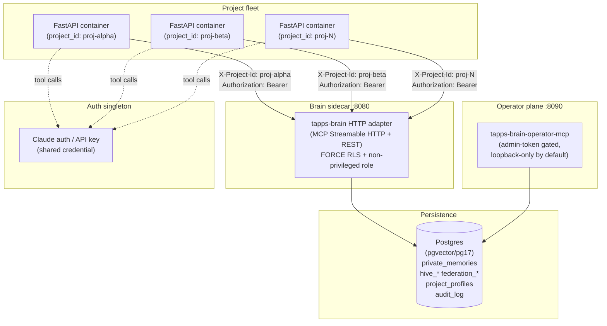

# Fleet Topology: N FastAPI Containers + 1 Brain Sidecar

> **Audience:** operators and integrators deploying tapps-brain as a shared
> sidecar service for multiple project containers (AgentForge, custom
> orchestrators, or any fleet of FastAPI-based agent hosts).
>
> For the single-process Python integration pattern, see
> [agentforge-integration.md](agentforge-integration.md).

---

## 1. Topology

The reference deployment runs **one brain sidecar** shared by **N
project-specific FastAPI containers**. Each container identifies itself per
request with an `X-Project-Id` header and a per-tenant bearer token. The
brain enforces row-level isolation in Postgres so no container can read
another's private memories — even in the event of a bug in application code.



**Per-container state that stays local:**

```
/app/data/assistant.db   ← execution log + conversation history (SQLite)
/app/SOUL.md             ← workspace personality / instructions
/app/USER.md             ← user preferences
/app/agents/             ← custom agent definitions
```

These are per-instance. They are deliberately **not** in the brain and should
never be moved there.

---

## 2. What the Brain Owns

All durable, cross-session knowledge lives in Postgres under `FORCE ROW LEVEL
SECURITY`. Every row is keyed by `(project_id, agent_id)` — a container
cannot read another project's rows even if it sends the wrong header, because
the non-privileged runtime role (`tapps_runtime`) cannot bypass RLS.

| Table / schema | What it stores |
|----------------|----------------|
| `private_memories` | Per-agent memories, tier / decay / confidence metadata |
| `hive_memories`, `hive_groups` | Cross-agent shared knowledge within a project |
| `federation_memories` | Cross-project pub/sub (opt-in, separate DSN) |
| `project_profiles` | Registered project → profile YAML mapping |
| `audit_log` | Immutable append-only write journal |
| `diagnostics_history` | Scorecard snapshots, EWMA anomaly state |
| `feedback_events` | Implicit and explicit feedback for the flywheel |
| `session_chunks` | Session-indexed context segments for recall |
| `idempotency_keys` | Dedup store for `X-Idempotency-Key` replay protection |

> **Isolation contract:** `FORCE ROW LEVEL SECURITY` + non-privileged role
> startup assertion shipped in **3.8.0** (TAP-512).  External summaries that
> attribute this to 3.9.0 are incorrect — the 3.9.0 batch was
> metrics/operator-tool hardening (TAP-545–552).  The authoritative record is
> `src/tapps_brain/postgres_connection.py:197–267` and the 3.8.0 CHANGELOG
> entry.

---

## 3. What a Project Container Owns

| Artifact | Location (typical) | Managed by |
|----------|--------------------|------------|
| Execution log + conversations | `/app/data/assistant.db` (SQLite) | AgentForge ADR-001/ADR-002 |
| Workspace personality | `/app/SOUL.md` | Per-instance operator |
| User preferences | `/app/USER.md` | Per-instance user |
| Custom agent definitions | `/app/agents/` | Per-instance operator |
| Container env / secrets | Docker secrets / K8s Secret | Infrastructure |

**These are not in the brain and are not meant to be.** The design split is:
- Durable, shared, cross-session knowledge → brain (Postgres).
- Ephemeral, per-project, per-conversation state → container (SQLite + files).

---

## 4. Wire Contract

Every request from a project container to the brain sidecar must include:

| Header | Required | Notes |
|--------|----------|-------|
| `Authorization: Bearer <token>` | Yes | Per-tenant token (see §6 — Token lifecycle). Validated with `hmac.compare_digest`. |
| `X-Project-Id` | Yes | Project slug registered with `tapps-brain project register`. Returns 400 if missing. |
| `X-Agent-Id` | No | Defaults to `"unknown"`. Use a stable agent name for per-agent isolation. |
| `X-Idempotency-Key` | No | UUID. Required only when `TAPPS_BRAIN_IDEMPOTENCY=1` is set on the sidecar. Replay-safe within the idempotency window. |

The full endpoint reference (request bodies, response shapes, error codes) is
in the OpenAPI snapshot at
[`docs/contracts/openapi.json`](../contracts/openapi.json) and the
[HTTP adapter guide](http-adapter.md).

### MCP path (`/mcp`)

```
POST http://brain-sidecar:8080/mcp
Authorization: Bearer <proj-alpha-token>
X-Project-Id: proj-alpha
X-Agent-Id: agentforge-main
Content-Type: application/json

{ "jsonrpc": "2.0", "method": "tools/call", "params": { ... } }
```

### REST path (`/memory`)

```
POST http://brain-sidecar:8080/memory/save
Authorization: Bearer <proj-alpha-token>
X-Project-Id: proj-alpha
X-Agent-Id: agentforge-main
Content-Type: application/json

{ "key": "...", "value": "...", "tier": "pattern" }
```

---

## 5. Deployment Checklist

Before going live with a multi-container fleet:

- [ ] **Pinned image tag** — all containers reference the same
  `ghcr.io/tapps/tapps-brain:<version>` tag, not `latest`.  The
  `brain-profile` Docker `LABEL` version must match the wheel version baked
  into the image (EPIC-077 / TAP-500 / TAP-555 invariant).
- [ ] **Wheel version pinned** — `tapps-brain==<version>` in `requirements.txt`
  (or `pyproject.toml`); never an open `tapps-brain>=3.x` range in production.
- [ ] **FORCE RLS verified** — run `tapps-brain maintenance verify-rls` (or
  check the startup log for `postgres.role_check_ok`) after every schema
  migration.  The sidecar refuses to start if the connected role can bypass
  RLS.
- [ ] **Non-privileged role in use** — connect as `tapps_runtime` (or an
  equivalent non-owner, non-superuser, `BYPASSRLS=false` role).  See
  `migrations/roles/001_db_roles.sql`.
- [ ] **`TAPPS_BRAIN_METRICS_TOKEN` set** — without it, `/metrics` responds
  200 but strips `project_id` / `agent_id` labels.  Set the token and point
  your Prometheus scraper at `Authorization: Bearer $TAPPS_BRAIN_METRICS_TOKEN`.
- [ ] **Operator MCP bound to loopback** — `docker-compose.hive.yaml`
  publishes port 8090 as `${TAPPS_OPERATOR_MCP_BIND:-127.0.0.1}:8090:8090`.
  Only set `TAPPS_OPERATOR_MCP_BIND=0.0.0.0` if the operator port is behind
  a reverse proxy with its own auth layer.
- [ ] **`TAPPS_BRAIN_MCP_ALLOWED_HOSTS` set** — comma-separated list of
  `host:port` entries for DNS-rebinding protection when containers call the
  sidecar via a Docker network hostname (e.g. `brain-sidecar:8080`).  As of
  v3.14.6 the shipped `docker-compose.hive.yaml` wires a sane default
  (`tapps-brain-http`/`localhost`/`127.0.0.1` on 8080+8090) so the brain no
  longer relies on the mcp SDK's back-compat fallback.  Override via
  `docker/.env` when running behind a different in-network DNS name.  When
  unset *and* bound to a non-loopback interface, the brain now derives an
  allow-list at startup and emits a warning so the gap is visible.
- [ ] **Migrations applied before rollout** — run
  `tapps-brain maintenance migrate` (or set `TAPPS_BRAIN_HIVE_AUTO_MIGRATE=1`)
  before starting new replicas.  Never rely on auto-migrate in multi-host
  deployments where two replicas might race.
- [ ] **Per-project bearer tokens issued** — each registered project has its
  own token (see §6).  No project shares a token with another.

---

## 6. Brain-Profile Lifecycle Runbook

The `tapps-brain project` CLI manages the mapping from project slug → profile
YAML and the per-tenant bearer token.

### Register a new project

```bash
# Register with a custom profile (seed document)
tapps-brain project register proj-alpha --profile ./profile.yaml

# Register with the default profile
tapps-brain project register proj-beta
```

### Issue / rotate a bearer token

```bash
# Print the plaintext token once — store it securely (env var or K8s Secret)
tapps-brain project rotate-token proj-alpha
```

Rotation immediately invalidates the previous token.  Update the environment
variable in the container before (or immediately after) rotating.

### Revoke a token (emergency)

```bash
tapps-brain project revoke-token proj-alpha
```

After revocation all requests from `proj-alpha` return 401 until a new token
is issued with `rotate-token`.

### Show / list registered projects

```bash
tapps-brain project list
tapps-brain project show proj-alpha
```

### Delete a project

```bash
tapps-brain project delete proj-alpha
```

> **Warning:** deletion removes the project profile registration.  Private
> memory rows in `private_memories` are **not** deleted by this command — they
> remain in Postgres under the project's `project_id`.  Run
> `tapps-brain maintenance purge-project proj-alpha` to hard-delete those rows
> (irreversible).

---

## 7. What NOT to Try

### Running the brain inside each project container

This defeats the purpose of the sidecar pattern.  Each container would have an
isolated, unshared memory store — Hive and cross-project federation would not
function.  The brain sidecar **must** be a distinct process/container with its
own stable Postgres connection pool.

### Pointing two project containers at the same `project_id`

If two separately operated projects (different teams, different tenants) use
the same `project_id`, they share private memory rows and bearer tokens.  Each
distinct project **must** be registered with a unique slug.  Use
`tapps-brain project list` to audit registered IDs before provisioning.

### Sharing a bearer token across projects

Per-tenant tokens are the primary auth signal used to resolve `project_id`
server-side.  A token issued for `proj-alpha` must never be reused for
`proj-beta`.  Rotate tokens per project; store each token in that project's
secret store only.

### Using `latest` image tags in production

Image tag drift between the brain wheel version and the `brain-profile` LABEL
causes subtle incompatibilities (profile schema mismatches, migration state
divergence).  Pin to an explicit version tag in every deployment manifest.

### Skipping the non-privileged role check

Connecting as `postgres` or another superuser/owner silences the FORCE RLS
protection entirely.  The role startup assertion (TAP-512, 3.8.0) refuses to
start in this configuration unless `TAPPS_BRAIN_ALLOW_PRIVILEGED_ROLE=1` is
explicitly set — use that override only for CI / dev environments with
**non-production data**.

---

## Related Guides

| Guide | What it covers |
|-------|----------------|
| [agentforge-integration.md](agentforge-integration.md) | Single-process `AgentBrain` integration (one container, library mode) |
| [hive-deployment.md](hive-deployment.md) | Postgres + pgvector Docker Compose setup, external networks, migration |
| [http-adapter.md](http-adapter.md) | Full HTTP endpoint reference (REST + MCP Streamable HTTP) |
| [idempotency.md](idempotency.md) | `X-Idempotency-Key` usage and replay semantics |
| [postgres-dsn.md](postgres-dsn.md) | All env vars, DSN format, connection pool tuning |
| [observability.md](observability.md) | Prometheus metrics, OTel, audit log, diagnostics scorecard |
| [deployment.md](deployment.md) | Single-node and HA deployment patterns |
| [OpenAPI snapshot](../contracts/openapi.json) | Machine-readable API contract (current version) |
