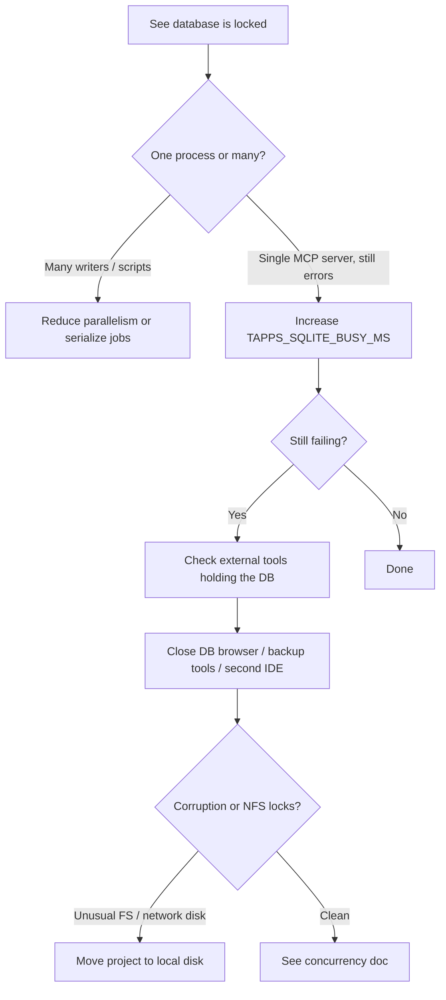

# SQLite “database is locked” — operator runbook

tapps-brain uses SQLite with **WAL** journal mode for project memory, Hive, federation hub, feedback, and diagnostics stores. Under contention you may see **`sqlite3.OperationalError: database is locked`** (or host messages that wrap it).

## Quick triage



## Tune: `TAPPS_SQLITE_BUSY_MS`

All connections opened via `connect_sqlite` (memory, Hive, feedback, diagnostics) and the **federation hub** apply:

`PRAGMA busy_timeout = <ms>`

| Variable | Meaning |
| -------- | ------- |
| `TAPPS_SQLITE_BUSY_MS` | Wait up to this many **milliseconds** for a locked page before returning `SQLITE_BUSY`. |
| *(unset or invalid)* | **5000** ms (5 s). |
| Valid range | **0** … **3600000** (0 = fail fast; upper bound avoids absurd waits). |

**Examples:**

```bash
# Linux / macOS — longer wait before surfacing errors (e.g. heavy parallel CLI)
export TAPPS_SQLITE_BUSY_MS=30000
```

Restart the MCP server or CLI after changing the environment.

**Interaction with app locks:** `MemoryStore` still serializes most work with a **process-local** lock. SQLite busy handling helps when multiple **SQLite** users overlap (WAL readers/writers, federation, or rare paths that briefly contend at the engine). It does not remove the single-lane store lock; see [`system-architecture.md`](../engineering/system-architecture.md) § *Concurrency model*.

## Other causes

- **Second process** opening the same `memory.db` (backup utility, `sqlite3` CLI, another agent).
- **SQLCipher** mis-key or mixed plain/encrypted opens — see [`sqlcipher.md`](sqlcipher.md).
- **Very slow disk** or **network-backed** project roots — WAL still needs reliable file locking.

## Read-only search connection (project memory, opt-in)

**Project** ``MemoryPersistence`` (``memory.db``) can open a **second** SQLite connection in **read-only** URI mode for:

- FTS ``search()``
- sqlite-vec ``sqlite_vec_knn_search()`` (when the extension is enabled)

This uses a dedicated ``threading.Lock`` (``_read_lock``) so these reads do not wait on the primary writer connection’s lock, while WAL still gives each reader a consistent snapshot.

| Variable | Meaning |
| -------- | ------- |
| ``TAPPS_SQLITE_MEMORY_READONLY_SEARCH`` | Set to ``1``, ``true``, or ``yes`` to enable. **Unset** = legacy behavior (single connection for search). |
| *(invalid / empty)* | Disabled (same as unset). |

If opening the read-only handle fails (platform, SQLCipher, or URI issues), the store **falls back** to the writer connection for that process lifetime. Helpers: ``connect_sqlite_readonly`` / ``resolve_memory_readonly_search_enabled`` in ``sqlcipher_util.py``.

**Not** a connection pool: one optional read handle per ``MemoryPersistence`` instance. Hive, federation, and other stores are unchanged.

## Related documentation

- Concurrency and lock timeout: [`system-architecture.md`](../engineering/system-architecture.md) § *Concurrency model* (`TAPPS_STORE_LOCK_TIMEOUT_S`).
- Encrypted DBs: [`sqlcipher.md`](sqlcipher.md).
